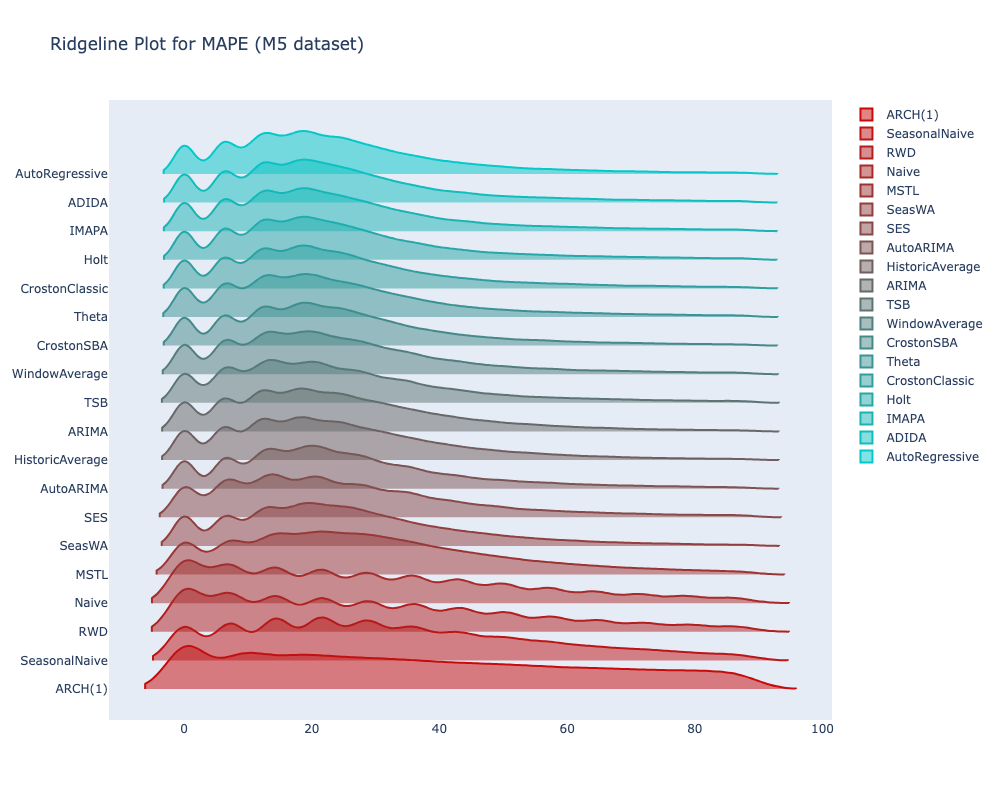

# Complex Comparison of Statistical and Econometrics Methods for Sales Forecasting

Sales forecasting is critical for decision-making in the retail industry. This study delves into the contemporary landscape of sales forecasting methods, aiming to empirically assess the performance of various statistical and econometric models. Through rigorous evaluation across diverse datasets, we aim to identify stable methods with reliable predictive capabilities. Our research contributes by establishing baseline models that offer trustworthy forecasts, thus guiding practical applications and future research efforts. The paper meticulously details the study’s methodology, results, and discussions, providing a comprehensive understanding of the strengths, limitations, and implications of the evaluated forecasting methods.

*Kosovan, O., Datsko, M.* (2024). **Complex Comparison of Statistical and Econometrics Methods for Sales Forecasting**. In: Silhavy, R., Silhavy, P. (eds) Data Analytics in System Engineering. CoMeSySo 2023. Lecture Notes in Networks and Systems, vol 935. Springer, Cham. [](https://github.com/OleksandrKosovan/complex-sales-forecasting/blob/main/files/preprint-complex-sales-forecasting.pdf)  [](https://doi.org/10.1007/978-3-031-54820-8_27)



# Data Sets

- M5 Forecasting. [URL](https://www.kaggle.com/competitions/m5-forecasting-accuracy/data)
- Hack4Retail by Fozzy Group. [URL](https://www.kaggle.com/datasets/adityasharma95/hack4retail-by-fozzy-group)
- Corporación Favorita Grocery Sales Forecasting. [URL](https://www.kaggle.com/competitions/favorita-grocery-sales-forecasting)

# Citation

If you use the findings or code from this repository in your research, please consider citing our paper:

```
Kosovan, O., Datsko, M. (2024). Complex Comparison of Statistical and Econometrics Methods for Sales Forecasting.
In: Silhavy, R., Silhavy, P. (eds) Data Analytics in System Engineering. CoMeSySo 2023.
Lecture Notes in Networks and Systems, vol 935. Springer, Cham. https://doi.org/10.1007/978-3-031-54820-8_27
```
